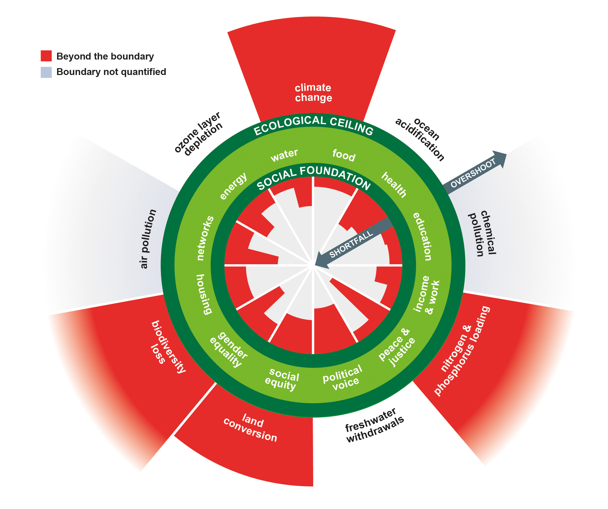

Climathon is an international movement, orchestrated by[ EIT Climate-KIC](https://www.climate-kic.org/), to engage cities and citizens in climate action! It lays the foundations for tangible projects, impact-driven start-ups and long-lasting conversations with decision-makers around city plans and policies. 

At the heart of our community are the Climathon local organisers who power the movement around the world. Policymakers, entrepreneurs, youth, business leaders, hackers, academics, students and professionals are invited to participate in this journey of co-creation, idea generation, and citizen engagement.

### How can you take part?

Climathon's mission is to connect cities and citizens across the world. You can get involved by taking the lead and bring Climathon to your city. By organising a Climathon you will have the opportunity to raise local climate awareness, strengthen local eco-systems and inspire further climate action. \
You can also take your ideas to the next level by joining a local Climathon as a participant.\
Last, but not least, you can support the growth of Climathon by partnering with us.

### Partner with us!

Partnerships with Climathon leverage everything that makes Climathon stand apart: our global network of local changemakers; our format providing citizens an opportunity to learn about local climate challenges and take action; and our proven methodology bringing cities and citizens together to co-create ideas.

The benefits of becoming a partner are:

* Increased impact in your community or region.
* Visibility in a network of  local organisers and changemakers
* Value-add for your existing services and activities
* Meet city officials and policymakers to discuss concrete climate change projects

### $$$ Become a sponsor $$$

By investing in the global Climathon movement you can maximise your climate action, and take part in developing a better future for communities around the world.

The benefits of becoming a sponsor are:

* Integrate into a large global community of policymakers, entrepreneurs, scientists, and participants through effective collaboration.
* The possibility to have an integral role in climate change solutions for a city or region of your choice.
* As main sponsor for our vertical (e.g. mobility) you become a part of our global board and network of impact-driven organisations.