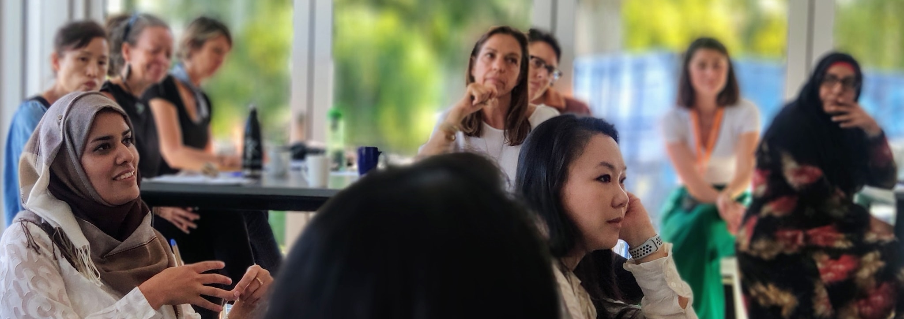

## We're here to help you grow your business

Impact Hub Auckland offers a range of entrepreneurial support services ranging from personalised 1-2-1 support for your specific business needs, to programme cohorts at similar stages of business. You can connect to tailored support in one of the below ways. 

## 1-2-1 Support

## Business Health Check

Our Business Health Check is a quick and easy way to take the temperature of your business and identify areas for improvement. You’ll be asked to fill in a short survey, and then you'll be connected with one of our Impact Associates. Our Business Health Check sessions take 2 hours and can be held via Zoom or in person.

Developing an effective marketing campaign

* Improving net profit drivers
* Building purpose into your business model
* Identifying new business channels & markets
* Improving your digital marketing strategy
* Developing an ecommerce strategy
* Setting up financial systems that work for your business
* Developing a consistent brand strategy
* Discovering new business markets & reaching new customers

[ ](https://forms.gle/1zFZcMY6STDeXv7C6)

## Connect with a Mentor

Our team of Associates is made up of experienced and talented entrepreneurial thinkers, experts and coaches who truly care about social, cultural and environmental impact. We want your experience to be seamless. When you apply for our services online, we connect you with the right expert and brief them on your requirements.

#### Through Impact Hub’s Mentor model you can get help in the following areas of business.

* Brand Management 
* Commercial/Venture Building Support
* Legal Support
* Business Validation
* Marketing Support
* Team Coaching
* Mindset Coaching
* Financial Planning
* Impact Management Support
* Business Support

[ ](https://forms.gle/6Ht6Q45hCZvRxELR8)

#### Want to become a Mentor? Get in touch with our team and we can send you more information.

## Group Learning

### Workbenches

Once a month, Impact Hub Auckland members can participate in our Workbench sessions, where experts in a variety of fields (legal, finance, funding, impact measurement) will support you with more complex questions so you can immediately take next steps to grow your business fast and efficiently.

Workbenches will be held at various community venues throughout Auckland or online and will cover on a different topic each month and will be available for all subscribed members.

### Workshops

Every second month, Impact Hub hosts an in person workshop at our hubs on a member generated topic, hosted by a different expert. Find out what's trending, learn new skills, problem solve, and gain the knowledge you need to help your business grow. 

Workshops are free for Impact Hub Members

#### Help your impact business grow

In our Workshops we've covered everything from SEO to Storytelling - here are some past workshop examples:

* Instagram Marketing - tips & tricks
* Sales mindset - how your for purpose business should approach sales
* Storytelling - how the art of storytelling can help you reach your audience
* SEO - what makes a great website
* Brand Strategy - building an impactful brand
* Growth Hacking - growth for impact entrepreneurs
* The F Word - yes we're talking Finances

[ ](https://forms.gle/S3xSzbbRG4tccF7aA)

### [Programmes](https://impacthubauckland.nz/programmes/)